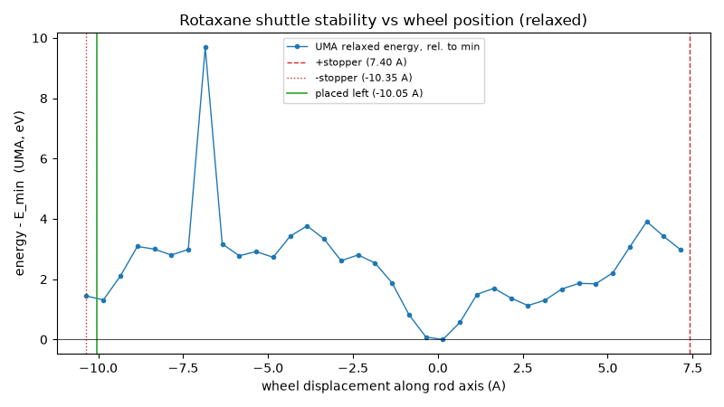
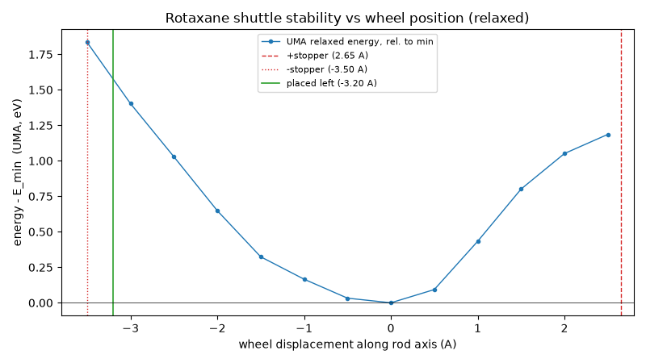
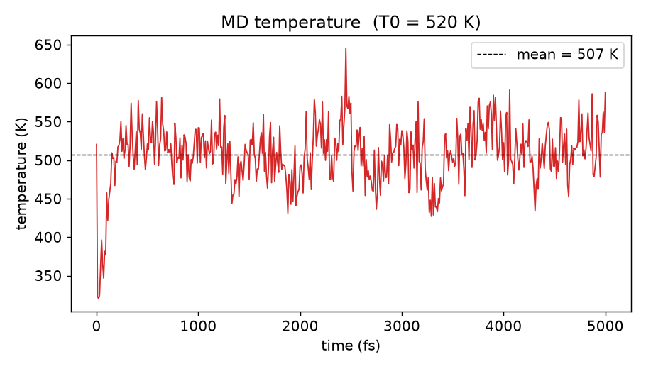
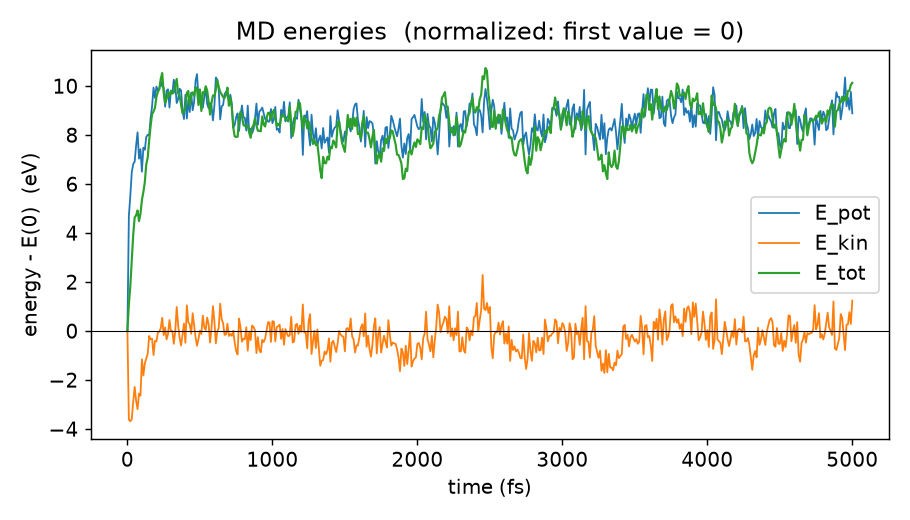
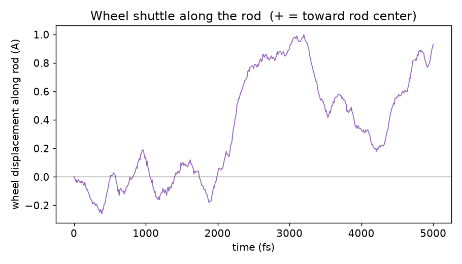
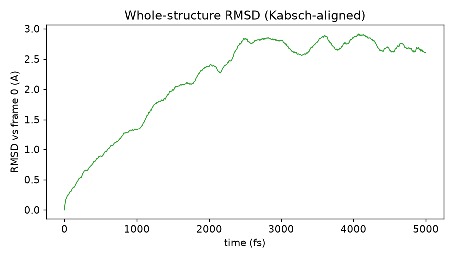

# Rotaxane builder + UMA molecular dynamics

Build a rotaxane (rod threaded through a wheel) from two SMILES, relax it with
Meta's **UMA** ML potential, and run ab-initio-style MD with UMA forces.

```
<stem>.txt  ─►  build_rotaxane.py  ─►  <stem>_center.xyz
                                          │
                                          ▼
                          optimize_uma.py  ─►  <stem>_relaxed.xyz  (+ _relax.pdb)
                                          │
                (optional) displace_wheel.py  ─►  <stem>_displaced.xyz
                                         │   └─►  <stem>_scan.png + _scan.csv  (energy vs position)
                                          │
                (optional) optimize_uma.py --input <stem>_displaced.xyz  ─►  relaxed displaced
                                          │
                                          ▼
                              run_md.py  ─►  <stem>_md.xyz  (+ .pdb)
```

All output filenames are derived from the input `.txt` file's **stem** (its
basename without `.txt`): feed it `rot1.txt` and you get `rot1_center.xyz`,
`rot1_relaxed.xyz`, `rot1_displaced.xyz`, `rot1_md.*`, etc. Each stage recovers
the stem from the `.xyz` it reads (by stripping the role suffix) and names its
own outputs `<stem>_<role>.<ext>`. The default stem is `rot_smiles`
(from `rot_smiles.txt`); the older `rotaxane*` files are legacy.

## Demo: SMILES → 3D

Each rotaxane is specified by just two SMILES strings — a rod and a wheel.
`build_rotaxane.py` turns those strings into a 3D structure: RDKit embeds each
fragment (`ETKDGv3` + `MMFF`), the rod's long axis is PCA-aligned to x and the
wheel's plane to yz, the wheel is threaded onto the rod at the steric-energy
minimum, and the result is then relaxed with UMA. The pictures below are the
relaxed structures rendered from the UMA-optimised XYZ.

### Rotaxane 1 (`rot_smiles.txt`) — 144 atoms (rod 88 + wheel 56)

```
rod:   O=C(C(C(F)=C1)=CC=C1C(C=C2)=CC=C2C(C=C3)=CC=C3C4=CC(F)=C(C(N(CC5=CC(C(F)(F)F)=CC(C(F)(F)F)=C5)[H])=O)C=C4)N(CC6=CC(C(F)(F)F)=CC(C(F)(F)F)=C6)[H]
wheel: O1CCOCCOCCOCCOCCOCCOCCOCC1
```


### Rotaxane 2 (`rot_smiles2.txt`) — 114 atoms (rod 58 + wheel 56)

```
rod:   O=C(C(C(F)=C1)=CC(F)=C1C(N(CC2=CC(C(F)(F)F)=CC(C(F)(F)F)=C2)[H])=O)N(CC3=CC(C(F)(F)F)=CC(C(F)(F)F)=C3)[H]
wheel: O1CCOCCOCCOCCOCCOCCOCCOCC1
```


(The wheel is the same 24-crown-8 in both; only the rod differs.)

## Inputs

`rot_smiles.txt` (two required lines, two optional):

```
rod:   <rod SMILES>
wheel: <wheel SMILES>
charge: 0      # optional, default 0 (used by optimize_uma.py / run_md.py)
spin: 1        # optional, default 1 (spin multiplicity)
```

The rod is a long, roughly 1D molecule; the wheel is a roughly 2D ring
(24-crown-8 here). `build_rotaxane.py` aligns the rod's long axis to x and the
wheel's plane to yz, co-centroids them, then nudges the wheel in yz and slides
it along x to minimise steric clashes.

## Setup

 Requires `uv` (Homebrew: `brew install uv`) and a HuggingFace token with
access to the UMA weights.

```sh
uv venv --python 3.12 .venv
uv pip install --python .venv/bin/python rdkit fairchem-core
export HF_TOKEN=<your huggingface token>   # put in ~/.zshrc
```

Notes:
- `fairchem-core` requires Python **<3.14**, so the env is 3.12 (not the
  system 3.14). Run scripts with `.venv/bin/python <script>`.
- `fairchem`'s MLIP predict unit only accepts `cpu` or `cuda` — Apple Silicon
  **MPS is not supported**. Device auto-selects `cuda` if available else `cpu`.

## Usage

```sh
# 1. assemble the rotaxane from SMILES (RDKit) -> <stem>_center.xyz
.venv/bin/python build_rotaxane.py                       # stem from rot_smiles.txt
.venv/bin/python build_rotaxane.py --smiles rot1.txt     # -> rot1_center.xyz

# 2. relax with UMA -> <stem>_relaxed.xyz + <stem>_relax.pdb
.venv/bin/python optimize_uma.py                         # reads <stem>_center.xyz
.venv/bin/python optimize_uma.py --input rot1_center.xyz # -> rot1_relaxed.xyz

# 3. (optional) relaxed stability-vs-position scan + slide to a steric extreme
.venv/bin/python displace_wheel.py                       # relaxed UMA scan (HF_TOKEN)
.venv/bin/python displace_wheel.py --scan-grid 0.25      # finer landscape
.venv/bin/python displace_wheel.py --no-scan             # placement only
#    at each wheel station the wheel is pinned along the rod and UMA relaxes it
#    in the perpendicular plane (loose fmax) to relieve bad sterics, then records
#    the energy -> <stem>_scan.png + <stem>_scan.csv  and  <stem>_displaced.xyz

# 3b. (optional) relax the displaced structure (auto-names _displaced_relaxed)
.venv/bin/python optimize_uma.py --input <stem>_displaced.xyz

# 4. MD with UMA forces -> <stem>_md.xyz + <stem>_md.pdb
.venv/bin/python run_md.py                               # defaults: 0.5 fs, 100 fs, Langevin 300 K
.venv/bin/python run_md.py --time 1000 --dt 1.0 --thermostat nve
.venv/bin/python run_md.py --input <stem>_displaced_relaxed.xyz
```

`build_rotaxane.py` options: `--smiles` (input .txt, sets the stem), `--out`.
`optimize_uma.py` options: `--input`, `--out-xyz`, `--out-pdb`, `--fmax`,
`--steps`, `--smiles` (charge/spin source). `displace_wheel.py` options:
`--side` (left|right|farther), `--margin`, `--input`, `--out`, `--scan-grid`
(A, default 0.5), `--scan-pad` (A, default 0), `--scan-fmax` (eV/A, default
0.5 -- loose, just relieves bad sterics), `--scan-steps` (default 20),
`--scan-emax` (eV plot clip, default none), `--no-scan`, `--smiles`. `run_md.py` options: `--input`, `--out-xyz`,
`--out-pdb`, `--dt` (fs), `--time` (fs), `--thermostat` (langevin|nve),
`--temperature` (K), `--friction` (1/fs), `--stride`, `--flush` (rewrite PDB+XYZ
every N steps so a killed run keeps its trajectory), `--seed`, `--smiles`.
`plot_md.py` options: `--log`, `--pdb` (sets the stem), `--prefix`, `--dt`,
`--log-interval`, `--no-rmsd`.

## Outputs

All geometry outputs are **PyMOL-friendly**: plain standard XYZ (element +
x y z) and multi-state PDB (one state per step; `load` then `mplay` in PyMOL).
ASE's extended XYZ (forces + long `Lattice/Properties` comment) is deliberately
avoided because PyMOL misreads it.

| file | from | content |
|---|---|---|
| `<stem>_center.xyz` | build_rotaxane.py | assembled, sterics-optimised |
| `<stem>_relaxed.xyz` | optimize_uma.py | UMA-relaxed final frame |
| `<stem>_relax.pdb` | optimize_uma.py | relaxation trajectory |
| `<stem>_scan.png` / `_scan.csv` | displace_wheel.py | relaxed UMA wheel energy vs position (stability scan) |
| `<stem>_displaced.xyz` | displace_wheel.py | wheel slid to a steric extreme |
| `<stem>_displaced_relaxed.xyz` | optimize_uma.py (on displaced) | UMA-relaxed displaced frame (strain-free MD start) |
| `<stem>_displaced_relax.pdb` | optimize_uma.py (on displaced) | displaced-structure relaxation trajectory |
| `<stem>_md.xyz` | run_md.py | MD final frame |
| `<stem>_md.pdb` | run_md.py | MD trajectory |
| `<stem>_md_*.png` | plot_md.py | temperature / energy / wheel / RMSD / overview plots |

Generated structure files are gitignored (regenerate by running the scripts).

### A second system

Because filenames are stem-driven, a second SMILES file is processed with no
name collisions — just point the pipeline at its `.txt` and every stage derives
its outputs from that file's stem:

```sh
.venv/bin/python build_rotaxane.py --smiles rot_smiles2.txt   # -> rot_smiles2_center.xyz
.venv/bin/python optimize_uma.py --input rot_smiles2_center.xyz
.venv/bin/python displace_wheel.py --input rot_smiles2_relaxed.xyz
.venv/bin/python run_md.py --input rot_smiles2_relaxed.xyz
```

## Results: shuttle stability scan (relaxed UMA)

Two systems, both using the 24-crown-8 wheel (56 atoms) with differing rods.
For each, `build_rotaxane.py` assembles the rotaxane, `optimize_uma.py`
relaxes it with UMA, then `displace_wheel.py` slides the wheel across the
clash-free travel window on a 0.5 A grid and records a **relaxed UMA energy at
each station**: the wheel is pinned along the rod axis and held rigid, the
rod's two endpoint atoms are anchored, and the rod middle is free to flex away
from the wheel under a loose convergence (fmax = 0.5 eV/A, 20 steps) -- just
enough to relieve bad sterics, not a full minimisation. This gives a real
shuttle landscape with minima and barriers as the wheel passes over the rod's
phenyl/CF3 features, rather than a rigid single-point profile. All energies
from UMA (`uma-s-1p1`, `omol`), CPU.

### Rotaxane 1 (`rot_smiles.txt`) -- 144 atoms (rod 88 + wheel 56), rod 28.6 A

Relaxation converges to E = -124662.29 eV, max|F| = 0.050 eV/A (84 steps,
`rot_smiles_relaxed.xyz`). Scan travel: -left 10.35 A, +right 7.40 A (36
points). The landscape is **multi-well** (`rot_smiles_scan.png` /
`rot_smiles_scan.csv`):

- global minimum at d ≈ 0 A (centred station, E_rel = 0) -- self-consistent
  with the relaxed geometry;
- left-stopper well at d = -9.85 A, E_rel ≈ +1.32 eV;
- secondary +side well at d = +2.65 A, E_rel ≈ +1.13 eV;
- sub-eV minima/barriers across the -5 to -2 A region as the wheel passes
  over individual phenyl groups;
- right-stopper wall rising to ~+3.9 eV by d = +6.15 A;
- one narrow transient clash spike at d = -6.85 A, E_rel ≈ +9.69 eV (closest
  contact 1.25 A) -- a single station where the wheel straddles a bulky
  CF3/phenyl group the loose relaxation cannot fully relieve. It dominates the
  printed accessible-window barrier (9.68 eV); the meaningful inter-well
  barriers are ~1.1-1.3 eV. Pass `--scan-emax` (e.g. `--scan-emax 5`) to clip
  just the display if the spike flattens the plot (the CSV keeps the true
  values).



### Rotaxane 2 (`rot_smiles2.txt`) -- 114 atoms (rod 58 + wheel 56), rod 16.8 A

Relaxation converges to E = -105800.86 eV, max|F| = 0.058 eV/A (200 steps,
`rot_smiles2_relaxed.xyz`). Scan travel: -left 3.50 A, +right 2.65 A (13
points). The shorter rod gives a **single-well** landscape
(`rot_smiles2_scan.png` / `rot_smiles2_scan.csv`): one central minimum at
d = 0 A (E_rel = 0), with walls rising fairly smoothly to +1.83 eV at the left
stopper (d = -3.50 A) and +1.19 eV at the right (d = +2.50 A);
accessible-window barrier = 1.83 eV. No secondary minima -- the short rod has
fewer bulky features to create them.

The contrast between the two -- multi-well on the long, feature-rich rod vs
single-well on the short, plain rod -- is exactly what the scan is meant to
surface, and it tracks the rod length (28.6 A vs 16.8 A) and feature count.



### Shuttle MD demo (legacy run)

An earlier 5 ps / 500 K Langevin NVT run (dt = 1 fs, stride = 5) from a
displaced station kicked the wheel off-centre to watch it shuttle: temperature
mean 508 K (range 320-645 K), and a ~1.0 A rightward wheel excursion from the
left station followed by a return -- asymmetric, because the start sits at a
stopper. The instantaneous wheel position was essentially uncorrelated with
the instantaneous temperature (corr = +0.06): the shuttle is an oscillator
whose position is set by its dynamics and the steric landscape, not by
moment-to-moment thermal energy. This run used the legacy `rotaxane_md_shuttle*`
naming; the stem-driven equivalent is
`run_md.py --input rot_smiles_displaced_relaxed.xyz`. Plots in `md_*.png`
(regenerate with `plot_md.py`).

## Plots










## Credits

- RDKit for 3D embedding and SMILES handling.
- `fairchem-core` / Meta's UMA (`uma-s-1p1`) for energies and forces.
- ASE for optimisation and dynamics.