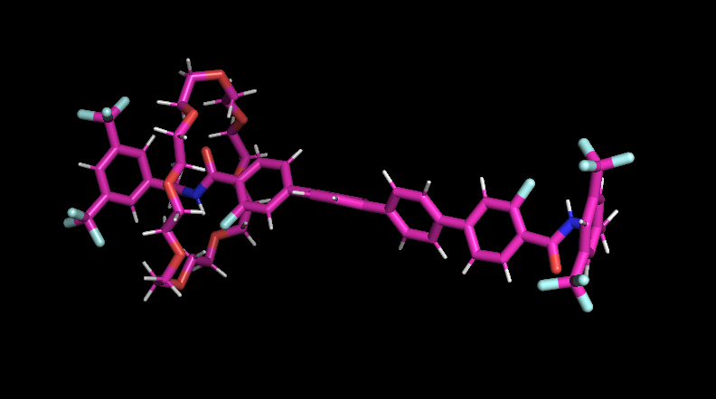
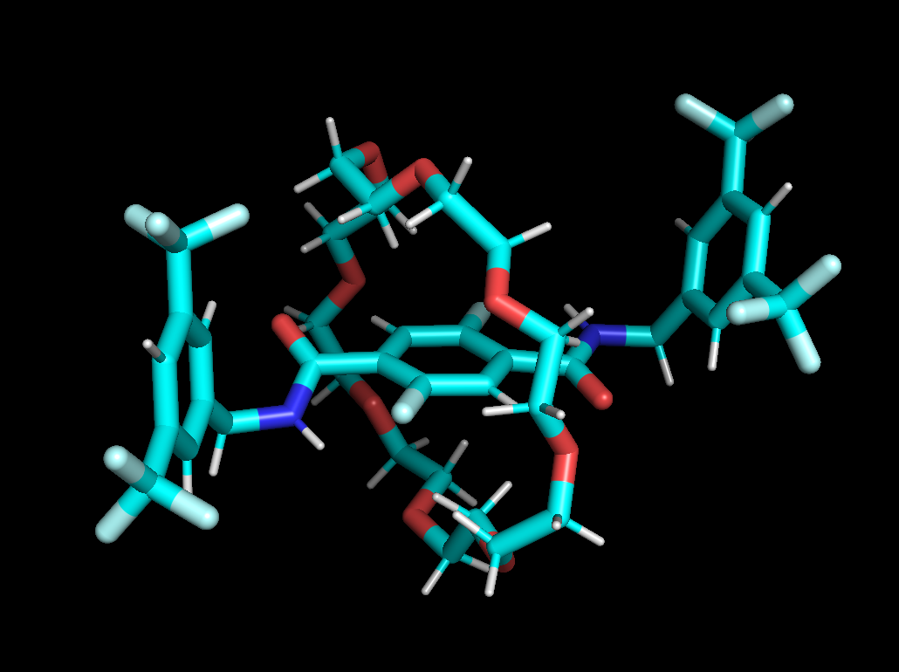
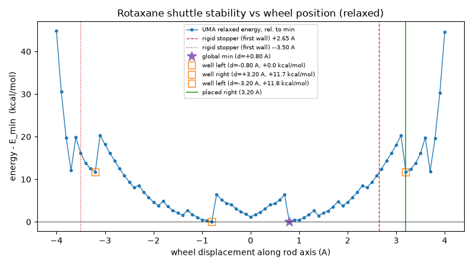
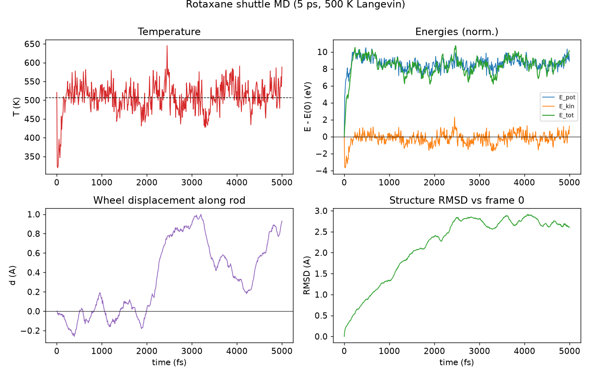

# Rotaxane builder + UMA molecular dynamics

Build a rotaxane (rod threaded through a wheel) from two SMILES, relax it with
Meta's **UMA** ML potential, and run ab-initio-style MD with UMA forces.

```
<stem>.txt  ─►  code/build_rotaxane.py  ─►  output_files/<stem>_center.xyz
                                                │
                                                ▼
                          code/optimize_uma.py  ─►  output_files/<stem>_relaxed.xyz  (+ _relax.pdb)
                                                │
                (optional) code/displace_wheel.py  ─►  output_files/<stem>_displaced.xyz
                                         │   └─►  images/<stem>_scan.png + output_files/<stem>_scan.csv
                                          │
                (optional) code/optimize_uma.py --input <stem>_displaced.xyz  ─►  relaxed displaced
                                                │
                                                ▼
                              code/run_md.py  ─►  output_files/<stem>_md.xyz  (+ .pdb)
```

The repo is organised into three folders:

- `code/` -- the pipeline scripts (`build_rotaxane.py`, `optimize_uma.py`,
  `displace_wheel.py`, `run_md.py`, `plot_md.py`, `rotaxane_paths.py`).
- `output_files/` -- generated run data: structures (`.xyz`), trajectories
  (`.pdb`), scan tables (`.csv`), and logs (`.log`).
- `images/` -- all plots (`.png`) and figures.

The input `<stem>.txt` files stay at the project root (next to this README);
everything the scripts generate is filed into `output_files/` or `images/`
automatically by `rotaxane_paths.py`.

All output filenames are derived from the input `.txt` file's **stem** (its
basename without `.txt`): feed it `rot1.txt` and you get
`output_files/rot1_center.xyz`, `output_files/rot1_relaxed.xyz`,
`output_files/rot1_displaced.xyz`, `output_files/rot1_md.*`, etc. Each stage
recovers the stem from the `.xyz` it reads (by stripping the role suffix) and
names its own outputs `<stem>_<role>.<ext>`. The default stem is `rot_smiles`
(from `rot_smiles.txt`); the older `rotaxane*` files are legacy.

## Demo: SMILES → 3D

Each rotaxane is specified by just two SMILES strings — a rod and a wheel.
`build_rotaxane.py` turns those strings into a 3D structure: RDKit embeds each
fragment (`ETKDGv3` + `MMFF`), the rod's long axis is PCA-aligned to x and the
wheel's plane to yz, the wheel is threaded onto the rod at the steric-energy
minimum, and the result is then relaxed with UMA. The pictures below are the
relaxed structures rendered from the UMA-optimised XYZ.

### Rotaxane 1 (`rot_smiles.txt`) — 144 atoms (rod 88 + wheel 56)

```
rod:   O=C(C(C(F)=C1)=CC=C1C(C=C2)=CC=C2C(C=C3)=CC=C3C4=CC(F)=C(C(N(CC5=CC(C(F)(F)F)=CC(C(F)(F)F)=C5)[H])=O)C=C4)N(CC6=CC(C(F)(F)F)=CC(C(F)(F)F)=C6)[H]
wheel: O1CCOCCOCCOCCOCCOCCOCCOCC1
```



### Rotaxane 2 (`rot2.txt`) — 114 atoms (rod 58 + wheel 56)

```
rod:   O=C(C(C(F)=C1)=CC(F)=C1C(N(CC2=CC(C(F)(F)F)=CC(C(F)(F)F)=C2)[H])=O)N(CC3=CC(C(F)(F)F)=CC(C(F)(F)F)=C3)[H]
wheel: O1CCOCCOCCOCCOCCOCCOCCOCC1
```



(The wheel is the same 24-crown-8 in both; only the rod differs.)

## Inputs

`rot_smiles.txt` (two required lines, two optional):

```
rod:   <rod SMILES>
wheel: <wheel SMILES>
charge: 0      # optional, default 0 (used by optimize_uma.py / run_md.py)
spin: 1        # optional, default 1 (spin multiplicity)
```

The rod is a long, roughly 1D molecule; the wheel is a roughly 2D ring
(24-crown-8 here). `build_rotaxane.py` aligns the rod's long axis to x and the
wheel's plane to yz, co-centroids them, then nudges the wheel in yz and slides
it along x to minimise steric clashes.

## Setup

 Requires `uv` (Homebrew: `brew install uv`) and a HuggingFace token with
access to the UMA weights.

```sh
uv venv --python 3.12 .venv
uv pip install --python .venv/bin/python rdkit fairchem-core
export HF_TOKEN=<your huggingface token>   # put in ~/.zshrc
```

Notes:
- `fairchem-core` requires Python **<3.14**, so the env is 3.12 (not the
  system 3.14). Run scripts with `.venv/bin/python code/<script>` from the
  project root.
- `fairchem`'s MLIP predict unit only accepts `cpu` or `cuda` — Apple Silicon
  **MPS is not supported**. Device auto-selects `cuda` if available else `cpu`.

## Usage

```sh
# 1. assemble the rotaxane from SMILES (RDKit) -> output_files/<stem>_center.xyz
.venv/bin/python code/build_rotaxane.py                       # stem from rot_smiles.txt
.venv/bin/python code/build_rotaxane.py --smiles rot1.txt     # -> output_files/rot1_center.xyz

# 2. relax with UMA -> output_files/<stem>_relaxed.xyz + output_files/<stem>_relax.pdb
.venv/bin/python code/optimize_uma.py                         # reads <stem>_center.xyz
.venv/bin/python code/optimize_uma.py --input output_files/rot1_center.xyz

# 3. (optional) chain-seeded relaxed shuttle scan + place the wheel at a side well
.venv/bin/python code/displace_wheel.py                       # chain scan; place at farther well (HF_TOKEN)
.venv/bin/python code/displace_wheel.py --production          # 300-step floor -> reporting-quality well depths
.venv/bin/python code/displace_wheel.py --side deeper         # place at the lowest-energy well instead
.venv/bin/python code/displace_wheel.py --place-rigid          # legacy rigid stopper-wall placement (strained)
.venv/bin/python code/displace_wheel.py --no-scan             # rigid placement only (skip the scan)
#    two monotonic outward sweeps from the central relaxed minimum; each station
#    is seeded from the previous relaxed geometry so the wheel threads through a
#    stopper incrementally (a fresh rigid start past a stopper does not converge on
#    CPU), and each sweep walks until the rod-tip wall (energy/contact cutoff).
#    the wheel is held rigid and the rod endpoints anchored, so only the rod's
#    internal flex relieves sterics; energies are reported in kcal/mol ->
#    images/<stem>_scan.png (global-min + well markers) + output_files/<stem>_scan.csv;
#    detected wells are printed with Eyring rate estimates, and the chosen well's
#    scan-relaxed geometry -> output_files/<stem>_displaced.xyz (MD-ready)

# 3b. (only with --place-rigid) relax the strained rigid placement (auto-names _displaced_relaxed)
.venv/bin/python code/optimize_uma.py --input output_files/<stem>_displaced.xyz
#    the well placement is already scan-relaxed and MD-ready -- skip this unless --place-rigid

# 4. MD with UMA forces -> output_files/<stem>_md.xyz + output_files/<stem>_md.pdb
.venv/bin/python code/run_md.py                               # defaults: 0.5 fs, 100 fs, Langevin 300 K
.venv/bin/python code/run_md.py --time 1000 --dt 1.0 --thermostat nve
.venv/bin/python code/run_md.py --input output_files/<stem>_displaced_relaxed.xyz
```

## Options

Every script derives its output names from the input file's **stem**, so the
common pattern is: `--input` (or `--smiles` for `build_rotaxane.py`) selects the
system, and `--out*` / `--side` etc. select what is written. Defaults are shown
in the second column.

### `build_rotaxane.py` — assemble the rotaxane from SMILES (RDKit)

| flag | default | description |
|---|---|---|
| `--smiles` | `rot_smiles.txt` | rod:/wheel: SMILES file at the project root. Its stem names all outputs (`rot1.txt` → `output_files/rot1_center.xyz`). |
| `--out` | `<stem>_center.xyz` | output assembled-geometry XYZ path. |

### `optimize_uma.py` — relax a geometry with UMA

| flag | default | description |
|---|---|---|
| `--input` | `<stem>_center.xyz` | starting geometry; its stem names the outputs. |
| `--out-xyz` | `<stem>_relaxed.xyz` | plain-XYZ of the final relaxed frame (PyMOL-friendly). |
| `--out-pdb` | `<stem>_relax.pdb` | multi-state PDB of the whole relaxation (`mplay` in PyMOL). |
| `--fmax` | `0.05` eV/Å | force convergence tolerance. |
| `--steps` | `200` | max optimisation steps. |
| `--smiles` | `<stem>.txt` | rod:/wheel: file to read optional `charge:`/`spin:` lines from. |

### `displace_wheel.py` — shuttle scan + place the wheel at a side well

| flag | default | description |
|---|---|---|
| `--input` | `<stem>_relaxed.xyz` | relaxed rotaxane; its stem names the outputs. |
| `--smiles` | `<stem>.txt` | rod:/wheel: file for atom counts + charge/spin (must match `build`). |
| `--out` | `<stem>_displaced.xyz` | placed-geometry XYZ (the MD start). |
| `--side` | `farther` | which detected well to place at: `left`/`right` = furthest well on that side, `farther` = largest \|d\|, `deeper` = lowest energy. Falls back to the rigid wall if no wells. |
| `--place-rigid` | off | force the legacy rigid stopper-wall placement (strained — relax with `optimize_uma.py` before MD). |
| `--margin` | `0.3` Å | back-off from the stopper wall (rigid fallback / `--place-rigid` only). |
| `--scan` / `--no-scan` | on | run / skip the relaxed shuttle scan (`--no-scan` forces `--place-rigid`). |
| `--scan-chain` / `--no-scan-chain` | chain | chain-seeded two-sweep scan (default; threads past stoppers, maps every well on a side) vs the legacy rigid fresh-start scan (can't map past a stopper). |
| `--scan-grid` | `0.25` Å | scan spacing (finer = better-resolved wells, slower). |
| `--scan-fmax` | `0.05` eV/Å | per-station relax force tolerance. |
| `--scan-steps` | `200` | max relax steps per station. |
| `--production` | off | raise `--scan-steps` to a floor of 300 so threading-event stations converge (reporting-quality well depths; only the 1–3 hard points use the extra steps). |
| `--scan-pad` | `4.0` Å | extend the rigid (`--no-scan-chain`) scan past each stopper; the chain scan ignores this and walks to the tip. |
| `--scan-walk-emax` | `40` kcal/mol | stop a chain sweep when the energy rises more than this above the scan min (past the last well, into the tip wall). |
| `--scan-walk-contact` | `1.2` Å | stop a chain sweep when the closest rod–wheel contact drops below this (a deep tip clash). |
| `--scan-emax` | none | clip the plot (not the CSV) at min + this kcal/mol so a stray tip point doesn't flatten the landscape. |
| `--rate-temp` | `300` K | temperature for the Eyring rate-estimate block. |
| `--no-rates` | off | skip the Eyring rate-estimate block in the scan summary. |

### `run_md.py` — UMA-driven MD

| flag | default | description |
|---|---|---|
| `--input` | `<stem>_relaxed.xyz` | starting geometry; its stem names the outputs. Not re-relaxed — any valid XYZ with matching atom order works (e.g. a well from `displace_wheel.py`). |
| `--smiles` | `<stem>.txt` | rod:/wheel: file for atom counts + charge/spin. |
| `--out-xyz` | `<stem>_md.xyz` | plain-XYZ of the final frame. |
| `--out-pdb` | `<stem>_md.pdb` | multi-state PDB trajectory. |
| `--dt` | `0.5` fs | timestep. |
| `--time` | `100` fs | total simulation length (short test default; scale up for real runs). |
| `--thermostat` | `langevin` | `langevin` (NVT) or `nve` (Velocity-Verlet). |
| `--temperature` | `300` K | temperature for velocity init / Langevin bath. |
| `--friction` | `0.01` 1/fs | Langevin friction. |
| `--stride` | `1` | store a trajectory frame every N steps. |
| `--flush` | `100` | rewrite the PDB+XYZ every N steps so a killed/aborted run keeps its trajectory. |
| `--seed` | `0xC0FFEE` | RNG seed for initial velocities. |

### `plot_md.py` — plot MD observables

| flag | default | description |
|---|---|---|
| `--pdb` | `<stem>_md.pdb` | multi-state PDB trajectory; its stem also sets `--log` and `--prefix` defaults. |
| `--log` | `<stem>_md.log` | MD stdout log (parsed for T / E / wheel position). |
| `--dt` | `1.0` fs | MD timestep (for the time axis). |
| `--log-interval` | `10` | MD log lines per step. |
| `--prefix` | `images/<stem>_md_` | output filename prefix. |
| `--no-rmsd` | off | skip the RMSD plot (don't read the PDB). |

## Outputs

All geometry outputs are **PyMOL-friendly**: plain standard XYZ (element +
x y z) and multi-state PDB (one state per step; `load` then `mplay` in PyMOL).
ASE's extended XYZ (forces + long `Lattice/Properties` comment) is deliberately
avoided because PyMOL misreads it. Structures, trajectories, CSVs and logs land
in `output_files/`; plots (`.png`) land in `images/`.

| file | from | content |
|---|---|---|
| `output_files/<stem>_center.xyz` | build_rotaxane.py | assembled, sterics-optimised |
| `output_files/<stem>_relaxed.xyz` | optimize_uma.py | UMA-relaxed final frame |
| `output_files/<stem>_relax.pdb` | optimize_uma.py | relaxation trajectory |
| `images/<stem>_scan.png` / `output_files/<stem>_scan.csv` | displace_wheel.py | relaxed UMA wheel energy vs position (kcal/mol, with global-min + well markers; CSV: displacement, energy eV, rel kcal/mol, min contact) |
| `output_files/<stem>_displaced.xyz` | displace_wheel.py | wheel placed at a detected side well (scan-relaxed, MD-ready) |
| `output_files/<stem>_displaced_relaxed.xyz` | optimize_uma.py (on `--place-rigid` displaced) | UMA-relaxed rigid displaced frame (only needed for the rigid placement) |
| `output_files/<stem>_displaced_relax.pdb` | optimize_uma.py (on displaced) | displaced-structure relaxation trajectory |
| `output_files/<stem>_md.xyz` | run_md.py | MD final frame |
| `output_files/<stem>_md.pdb` | run_md.py | MD trajectory |
| `images/<stem>_md_*.png` | plot_md.py | temperature / energy / wheel / RMSD / overview plots |

Generated structure files are gitignored (regenerate by running the scripts).

### A second system

Because filenames are stem-driven, a second SMILES file is processed with no
name collisions — just point the pipeline at its `.txt` and every stage derives
its outputs from that file's stem:

```sh
.venv/bin/python code/build_rotaxane.py --smiles rot2.txt          # -> output_files/rot2_center.xyz
.venv/bin/python code/optimize_uma.py --input output_files/rot2_center.xyz
.venv/bin/python code/displace_wheel.py --input output_files/rot2_relaxed.xyz --production
.venv/bin/python code/run_md.py --input output_files/rot2_displaced.xyz
```

## Results: shuttle stability scan (relaxed UMA)

Two systems, both using the 24-crown-8 wheel (56 atoms) with differing rods.
For each, `build_rotaxane.py` assembles the rotaxane, `optimize_uma.py`
relaxes it with UMA, then `displace_wheel.py` maps the shuttle landscape with a
**chain-seeded relaxed scan**. Two monotonic outward sweeps leave the central
relaxed minimum and step the wheel along the rod a quarter ångström at a time;
each station is seeded from the previous relaxed geometry so the wheel threads
through a stopper incrementally (a fresh rigid start past a stopper sits in
deep overlap and does not converge on CPU). At each station the wheel is held
rigid and the rod's two endpoint atoms are anchored, so the only free degrees of
freedom are the rod's internal flex (phenyl/CF3 groups rotating away from the
wheel) -- the scan coordinate stays fixed while bad sterics are relieved. Each
sweep walks until it has mapped every well on its side and hits the rod-tip
wall (energy or contact cutoff), so multiple wells on a long rod are captured.
Energies are reported in **kcal/mol**; `detect_wells` then picks the local
minima separated from the global minimum by a > 3 kcal/mol barrier (after
smoothing rod-conformer noise and snapping each basin to its true raw
minimum), and prints an Eyring TST rate estimate per well. All energies from
UMA (`uma-s-1p1`, `omol`), CPU.

> The landscape is on the wheel-rigid / rod-endpoint-anchored **constrained
> surface**, so it includes some rod-conformer relaxation; well depths and
> barriers are on that surface, not the free PES. The Eyring rates are
> order-of-magnitude estimates (potential barriers treated as free-energy
> barriers with the kBT/h prefactor) -- use them to rank wells and expose
> asymmetry, not as absolute rates. Use `--production` for reporting-quality
> well depths (it lets the hard threading-event stations converge).

### Rotaxane 2 (`rot2.txt`) -- 114 atoms (rod 58 + wheel 56), rod 16.8 A

Relaxation converges to E = -105801.09 eV, max|F| ≈ 0.05 eV/Å
(`output_files/rot2_relaxed.xyz`). A `--production` chain scan (grid 0.25 Å,
300-step floor, 55 points, `images/rot2_scan.png` /
`output_files/rot2_scan.csv`) finds the global minimum at d = −1.50 Å and **two
side wells** past the stoppers:

- left well at d = −5.75 Å, E_rel = +9.57 kcal/mol, barrier = 18.8 kcal/mol;
- right well at d = +3.50 Å, E_rel = +9.41 kcal/mol, barrier = 12.0 kcal/mol.

Both sweeps stop at the tip walls (d = +6.50 and −7.00 Å, ≈ +55 kcal/mol), past
the wells and before the deep tip. The Eyring rate estimates (300 K) make the
asymmetry explicit: the right well empties to the centre in ~90 µs, the left
well in ~8 s, while reaching a side well *from* the centre is far slower
(centre→right ~10 min, centre→left ~years). So a wheel parked in the left well
(the default `--side farther` placement, since |−5.75| > |+3.50|) is a
long-lived metastable station and a good MD start; one in the right well would
relax back to centre almost immediately.



### Rotaxane 1 (`rot_smiles.txt`) -- 144 atoms (rod 88 + wheel 56), rod 28.6 A

Relaxation converges to E = -124662.29 eV, max|F| = 0.050 eV/Å (84 steps,
`output_files/rot_smiles_relaxed.xyz`). The longer, feature-richer rod gives a
**multi-well** landscape (`images/rot_smiles_scan.png` /
`output_files/rot_smiles_scan.csv`): a centred global minimum plus wells near
both stopper regions and sub-structure across the centre as the wheel passes
over individual phenyl groups. (The detailed figures in the plot/CSV are from
an earlier rigid-scan run; re-run `code/displace_wheel.py --input
output_files/rot_smiles_relaxed.xyz --production` to regenerate them with the
current chain scan and kcal/mol well depths + rate estimates.)


The contrast between the two -- rich multi-well landscape on the long rod vs a
cleaner central-plus-two-side-well landscape on the short rod -- is exactly
what the scan is meant to surface, and it tracks the rod length (28.6 Å vs
16.8 Å) and feature count.

### Shuttle MD demo (legacy run)

An earlier 5 ps / 500 K Langevin NVT run (dt = 1 fs, stride = 5) from a
displaced station kicked the wheel off-centre to watch it shuttle: temperature
mean 508 K (range 320-645 K), and a ~1.0 A rightward wheel excursion from the
left station followed by a return -- asymmetric, because the start sits at a
stopper. The instantaneous wheel position was essentially uncorrelated with
the instantaneous temperature (corr = +0.06): the shuttle is an oscillator
whose position is set by its dynamics and the steric landscape, not by
moment-to-moment thermal energy. This run used the legacy `rotaxane_md_shuttle*`
naming; the stem-driven equivalent is
`code/run_md.py --input output_files/rot_smiles_displaced_relaxed.xyz`. Plots in
`images/md_*.png` (regenerate with `code/plot_md.py`).

## Plots




## Roadmap: vibrational free-energy (ΔG) shuttle landscape

The scan gives **potential** shuttle barriers (well vs saddle, kcal/mol) and
Eyring TST rate *estimates*. `vib_stations.py` adds a vibrational free-energy
correction to turn those into **free-energy** barriers (ΔG = E_relaxed + F_vib),
via a constrained partial Hessian (FixAtoms all wheel atoms + the 2 rod-tip
anchors → Hessian over the free atoms only; the frozen reaction coordinate is
removed, so a saddle is positive-definite too). See `code/vib_stations.py`
header for the rationale.

**Status (2026-07-15): the ΔG barrier is broken, and the cause is now pinned
down — it is methodological, not the engine.** On both UMA *and* GFN2-xTB the
free-energy barrier **inverts/collapses** (ΔG_saddle ≤ ΔG_well: left +1.06,
right −0.08 kcal/mol vs the 6.4 kcal/mol potential barrier on GFN2). Root cause:
the per-station **tight re-relax** (`vib_stations.py --relax-fmax 0.005`) does
**not** hold the reaction coordinate d. Even with all 56 wheel atoms + the 2
rod-tip atoms `FixAtoms`-pinned, the **rod bows** (residual RMSD up to ~12 Å) and
`d_after` drifts +0.5–0.95 Å — so the scalar d is not geometrically frozen, the
saddle relaxes down into the well, and the barrier vanishes. The `E_relaxed`
column already shows the inversion *before* any F_vib is added. The GFN2 run
reproduces the UMA failure mode exactly, just cheaper, which rules out the
engine as the culprit. GFN2 *potential* scan is clean and perfectly symmetric
(max |E(+d)−E(−d)| = 0.000 kcal/mol over 47 mirror pairs; 2 wells at d=±1.40 Å,
barrier 6.4; no stopper wells — the wheel climbs monotonically to the rod tips).

GFN2 run outputs (all `_tblite`-tagged): `output_files/rot2_relaxed_tblite.xyz`,
`rot2_scan_tblite.csv`/`.png`, `rot2_displaced_tblite.xyz`, `rot2_stations_tblite/`
(95 stations), `rot2_freeenergy_tblite.csv`, `rot2_vibstations_tblite/` +
`rot2_vibstations_view_tblite.pdb`, `images/rot2_freeenergy_tblite.png`.

### Forks (fork 1 chosen, others kept open)

1. **Rigid self-consistent (CHOSEN, DONE 2026-07-15).** Take the Hessian on the
   scan's *own* converged geometry — **no re-relax** (`--relax-fmax 0`, the relax
   block is skipped when fmax is 0) — so E and F_vib come from the *same*
   converged geometry and d cannot drift. ΔG(d) = E_scan(d) + F_vib(d); the
   barrier is read off the continuous curve. Keeps the 6.4 kcal/mol potential
   barrier and adds the rod-flex entropic correction.
   - **Result (rot2, GFN2, `--all-stations --all-stations-step 0.20`,
     51 stations, ~56 min):** self-consistency is *exact* —
     `max|E_relaxed − E_scan| = 0.00 kcal` and `max|d_shift| = 0.00 Å` across all
     stations (vs the broken tight-relax run's d_shift +0.47…+0.95 and inverted
     ΔG +1.06/−0.08). The ΔG inversion is gone: **shuttle barrier (well → well
     over the ±1.3 saddle) ≈ +9.4 kcal/mol** (left 9.73 / right 9.07), = the
     +6.36 potential barrier + ~3 kcal F_vib (saddle stiffer than well). The
     **free-energy minima are the side wells at d=±1.4** (G_rel ≈ −0.5…−1.4,
     *below* the d=0 potential min): the wheel is vibrationally freer at the
     wells (F_vib ~193–194) than at the center (~199), so entropy shifts the
     equilibrium out of d=0; d=0 becomes a shallow local free-energy max between
     the wells. Central barrier region symmetric to ~1 kcal.
   - **Caveat (confirmed).** The Hessian is taken at a *loose*-converged
     geometry (scan fmax 0.05), so small residual free-atom forces give 1–3 tiny
     imaginary modes per station (even at the global min); these are *dropped
     from the thermo* (`ignore_imag_modes=True`, real freqs only) and don't enter
     F_vib. The fluctuating dropped-mode count adds up to ~3 kcal of F_vib noise
     at the strained rod-tip ends (`max|G(+d)−G(−d)| ≈ 3.3 kcal`); the central
     barrier region is clean. For publication-quality ends, tighten the *scan*
     (`displace_wheel --scan-fmax 0.01`) so the station geometry is a cleaner
     stationary point in the free-atom subspace.
2. **Free-wheel 1D PMF (kept open).** Drop the rigid-wheel approximation: write
   a custom ASE constraint that holds the scalar d = (wheel_centroid −
   rod_centroid)·u fixed while the wheel is free to deform/rotate, and sample a
   1D PMF in d. Gives the *real* (lower) threading barrier. Needs new constraint
   code + a full re-run. Most correct of the ASE-native options; more work.
3. **WT-MetaD, Leanza route (kept open, most rigorous).** Well-Tempered
   Metadynamics with 2 CVs (CV1 = d along axle, CV2 = wheel-internal
   benzene–benzene distance) + explicit solvent, then *separate* infrequent
   WT-MetaD for kinetics (do **not** read ΔG‡ off the thermo run). Reference:
   Leanza et al., *Chem. Sci.* 2023, 14, 6716–6729 (DOI 10.1039/d3sc01593a),
   PDF at `rotaxane_md.pdf`, plumID 23.021 (ESI has the numbers). UMA-on-CPU
   (~1.07 s/eval, MPS unsupported) makes ns-scale multi-walker sampling expensive;
   ASE has no first-class WT-MetaD (drive via PLUMED-ASE or hand-roll the
   history-dependent bias).

### `vib_stations.py` — constrained partial-Hessian ΔG at scan stations

| flag | default | description |
|---|---|---|
| `--input` | `<stem>_displaced.xyz` | stem source only (geometry NOT read); stations come from `<stem>_stations[_engine]/`. |
| `--smiles` | `<stem>.txt` | rod/wheel file for atom counts. |
| `--engine` | `uma` | must match the scan engine; tblite reads the `_tblite`-tagged CSV + stations dir. |
| `--method` | `GFN2-xTB` | tblite method (ignored for uma). |
| `--relax-fmax` | `0.005` eV/Å | tight re-relax of free atoms. **`0` = skip re-relax (fork-1 self-consistent mode; fixes the ΔG inversion).** |
| `--rigid-wheel` / `--no-rigid-wheel` | on | FixAtoms all wheel atoms (default) vs pin only `--fix-wheel` spread atoms (does NOT hold d for the flexible crown-ether wheel — testing only). |
| `--fix-wheel` | `3` | spread wheel atoms to pin (only with `--no-rigid-wheel`). |
| `--no-rod-anchors` | off | don't fix the 2 rod-tip atoms. |
| `--delta` | `0.01` Å | central-difference step for the Hessian. |
| `--no-hessian` | off | constrained-relax only (no Hessian/thermo); saves the relaxed geometries. |
| `--stations` | `auto` | `auto` = global min + wells + their saddles from the scan CSV, or an explicit `d1,d2,…` list. |
| `--all-stations` | off | with `--stations auto`, ALSO run every Nth dumped scan station (dense G(d) curve) in addition to the auto wells/saddles/global min (kept so the barrier block still pairs them). Targets `n*step` snapped to the nearest dumped station. |
| `--all-stations-step` | `0.20` Å | spacing of the `--all-stations` curve; a multiple of the 0.10 Å scan grid so targets land on real stations. |
| `--barrier-min` | `3.0` kcal/mol | well/min separation threshold for `auto` station picking. |
| `--smooth-pts` | smoothing window | rod-conformer-bump smoothing for well detection. |
| `--temperature` | `300` K | thermo temperature for F_vib. |
| `--n-procs` | `1` | parallel ASE Vibrations workers sharing a scratch cache. |
| `--save-geometries` / `--no-save-geometries` | on | write relaxed station XYZs + a multi-state view PDB. |

### `plot_freeenergy.py` — overlay potential + Gibbs along the scan

| flag | default | description |
|---|---|---|
| `--stem` | `rot2` | stem of the scan + freeenergy CSVs. |
| `--engine` | `uma` | engine tag of the CSVs to read (`tblite` → `_tblite`-tagged). Must match the vib_stations run. |
| `--out` | `images/<stem>_freeenergy[_engine].png` | PNG path. |
| `--emax` | none | kcal/mol y-axis clip. |

## Credits

- RDKit for 3D embedding and SMILES handling.
- `fairchem-core` / Meta's UMA (`uma-s-1p1`) for energies and forces.
- ASE for optimisation and dynamics.